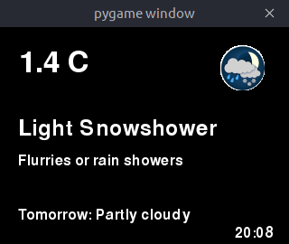

```
       _   ___   _ _  
\    /|_ /\ ||_||_|_) 
 \/\/ |_/--\|| ||_| \ 
                      
```

Display the current weather from the Government of Canada on a Raspberry Pi (or any machine running PyGame)



## Installation

### Raspberry Pi

`sudo apt-get install python-pygame python-xmltodict`

Set up the [PiTFT](https://www.adafruit.com/product/2298) using [these instructions form Adafruit](https://learn.adafruit.com/adafruit-pitft-28-inch-resistive-touchscreen-display-raspberry-pi/easy-install-2)

Open up `/etc/rc.local` and add

`sudo python /home/pi/weather/weather.py &`

### Everything Else

`pip install -r requirements.txt`


